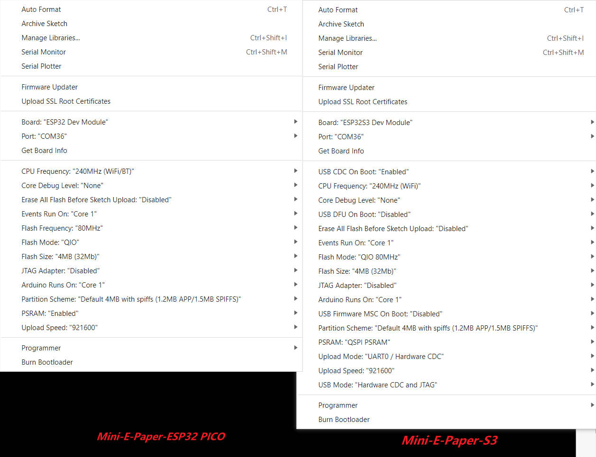
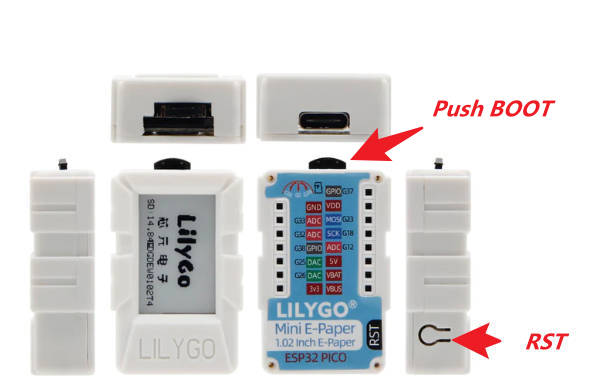

<h1 align = "center">🌟LilyGO Mini Epaper🌟</h1>

--------------------------------------
## 1️⃣Product

| Product(PinMap)              | SOC         | Flash | PSRAM     | Resolution | Size      | Driver       |
| ---------------------------- | ----------- | ----- | --------- | ---------- | --------- | ------------ |
| [Mini-E-Paper-ESP32 PICO][1] | ESP32-PICO  | 4MB   | x         | 128x80     | 1.02 Inch | GDGDEW0102T4 |
| [Mini-E-Paper-S3][2]         | ESP32-FN4R2 | 4MB   | 2MB(QSPI) | 128x80     | 1.02 Inch | GDGDEW0102T4 |

[1]: https://www.lilygo.cc/products/mini-e-paper-core?variant=42466407710901
[2]: https://www.lilygo.cc

<h2 align = "left">Quick start ⚡:</h2>

## 2️⃣ PlatformIO Quick Start (Recommended)

1. Install [Visual Studio Code](https://code.visualstudio.com/) and [Python](https://www.python.org/)
2. Search for the `PlatformIO` plugin in the `VisualStudioCode` extension and install it.
3. After the installation is complete, you need to restart `VisualStudioCode`
4. After restarting `VisualStudioCode`, select `File` in the upper left corner of `VisualStudioCode` -> `Open Folder` -> select the `LilyGO-Mini-Epaper` directory
5. Wait for the installation of third-party dependent libraries to complete
6. Click on the `platformio.ini` file, and in the `platformio` column
7. Select the board name you want to use in `default_envs` and uncomment it.
8. Uncomment one of the lines `src_dir = xxxx` to make sure only one line works
9. Click the (✔) symbol in the lower left corner to compile
10. Connect the board to the computer USB
11. Click (→) to upload firmware
12. Click (plug symbol) to monitor serial output
13. If it cannot be written, or the USB device keeps flashing, please check the **FAQ** below

## 3️⃣ Arduino IDE Quick Start

* It is recommended to use platformio without cumbersome steps

1. Install [Arduino IDE](https://www.arduino.cc/en/software)
2. Install [Arduino ESP32 2.0.5 or above](https://docs.espressif.com/projects/arduino-esp32/en/latest/) 
3. Copy all folders in [lib folder](./lib/)  to Arduino library folder (e.g. C:\Users\YourName\Documents\Arduino\libraries)
4. Open ArduinoIDE  ,`Tools` , Look at the picture to choose
   
5. `LilyGO-Mini-Epaper` -> `Any Examples`
6. Select `Port` (`Mini-E-Paper-ESP32 PICO`  requires an external U2T to discover the port)
7. Click `upload` , Wait for compilation and writing to complete
8. If it cannot be written, or the USB device keeps flashing, please check the **FAQ** below

# 6️⃣ FAQ

1. `Mini-E-Paper-S3` uses USB as the JTAG upload port. When printing serial port information on USB_CDC_ON_BOOT configuration needs to be turned on.
2. If the port cannot be found when uploading the program or the USB has been used for other functions, the port does not appear.
Please enter the upload mode manually.
   1. Connect the board via the USB cable (`Mini-E-Paper-ESP32 PICO`  requires an external U2T to discover the port)
   2. Press and hold the BOOT button , While still pressing the BOOT button, press RST
      
   3. Release the RST
   4. Release the BOOT button
   5. Upload sketch
3. If the above is invalid, burn the [binary file](./firmware/README.MD)  to check whether the hardware is normal

